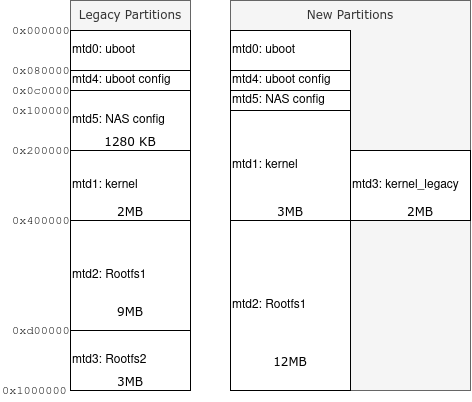

# QNAP partitions resize for kirkwood devices on Debian (Bullseye, Bookworm)

As [explained by Martin Michlmayr](https://www.cyrius.com/debian/kirkwood/qnap/ts-219/upgrade/), since Debian bullseye support on kirkwood QNAP devices was dropped due to [mainly] the limited size of the Kernel partition (2MB).

Indeed:

- Bullseye standard kernel image (eg. vmlinuz-5.10.0-8-marvell) is 2445216 bytes long (2.3MiB).

- Bookworm (eg. vmlinuz-6.1.0-9-marvell ) is 2678784 bytes (2.55MiB)

In addition, partition for initrd is also limited (9MB) which may lead to space issues.

Hopefully, some space is still unused for Debian in QNAP 16MB NOR flash. 

- An additional 3MB Rootfs2 partition is used by original QNAP firmware for its own purpose (install on empty HDD ?)
- A "NAS config" partition is 1.2MB large despite containing few configuration files (<128KB). This partition can be resized to 256KB (Flash block size) without losing the information.


## New Layout

With this script, we propose to use a new flash layout



- We keep /dev/mtdX numbers mapping, in case some other users are using a fix numbering.
- we keep a window on legacy kernel mapping to help if we want to restore the original QNAP firmware or to install the Buster installer
- Rootfs1 is larger but use the same start offset (simplify the transition since no write in flash is required)
- Kernel is larger. We must be careful during the transition since offsets are different.

With this new layout, we can transparently upgrade to Bullseye

- More room for kernel and initrd
- Future kernel updates performed during `apt upgrade`will use the new layout without any further change or manual operations.

## Linux Flash partitionning Documentation

If you are interested into the details, documentation is here:

[Partitionning_details.md](Partitionning_details.md)

## Resize process

### First, Do a backup of your MTD

```
cat /dev/mtd0 > /tmp/mtd0.uboot.backup
cat /dev/mtd1 > /tmp/mtd1.kernel.backup
cat /dev/mtd2 > /tmp/mtd2.rootfs1.backup
cat /dev/mtd3 > /tmp/mtd3.rootfs2.backup
cat /dev/mtd4 > /tmp/mtd4.uboot-config.backup
cat /dev/mtd5 > /tmp/mtd5.nas-config.backup
cd /tmp
tar cvzf mtd_backup.tgz mtd?.*.backup
```

And save this `mtd_backup.tgz`on your PC, transfering the file with scp / sftp or a USB drive....

### Then, donwload and run qnap_mtd_resize.py

You can download directly the script:

```
wget https://raw.githubusercontent.com/amouiche/qnap_mtd_resize_for_bullseye/master/qnap_mtd_resize.py
chmod a+x qnap_mtd_resize.py
```

A first run with `--dry-run`option to check that everything will be fine (except flashing)

```
sudo ./qnap_mtd_resize.py --dry-run
```

Example of dry-run log [here.](resources/QNAP_TS419_family_dryrun_log.txt)

If everything is fine run again without `--dry-run`

```
sudo ./qnap_mtd_resize.py
```

And reboot...

You are now running the same system, but with more room:

```
$ cat /proc/mtd 
dev:    size   erasesize  name
mtd0: 00080000 00040000 "uboot"
mtd1: 00300000 00040000 "Kernel"
mtd2: 00c00000 00040000 "RootFS1"
mtd3: 00200000 00040000 "Kernel_legacy"
mtd4: 00040000 00040000 "U-Boot Config"
mtd5: 00040000 00040000 "NAS Config"
```

Which makes possible to install Bullseye's kernel:

```
$ flash-kernel 
kirkwood-qnap: machine: QNAP TS219 family
Using DTB: kirkwood-ts219-6281.dtb
Installing /usr/lib/linux-image-5.10.0-8-marvell/kirkwood-ts219-6281.dtb into /boot/dtbs/5.10.0-8-marvell/./kirkwood-ts219-6281.dtb
Taking backup of kirkwood-ts219-6281.dtb.
Installing new kirkwood-ts219-6281.dtb.
flash-kernel: installing version 5.10.0-8-marvell
flash-kernel: appending /usr/lib/linux-image-5.10.0-8-marvell/kirkwood-ts219-6281.dtb to kernel
Generating kernel u-boot image... done.
Flashing kernel (using 2455558/3145728 bytes)... done.
Flashing initramfs (using 3992060/12582912 bytes)... done.
```

## Troubleshooting

### "NAS config" resize issue

The resize of "NAS config" partition may fail if the current content can't be repaired. In this case you will see the message.

```
e2fsck failed. 'NAS config' resize not possible automatically
```

You can decide to skip the `e2fsck` + `resize2fs` process. The content of "NAS config" will be lost, but it is not used by Debian anyway, and you still have the old MTD partition backup done in case of recovery...

Run  qnap_mtd_resize.py again with additional --drop-nas-config option:

```
sudo ./qnap_mtd_resize.py --drop-nas-config --dry-run
```

Then, if everything is fine:

```
sudo ./qnap_mtd_resize.py --drop-nas-config
```

## Additional configuration to improve `initrd` size

Even if we increase Rootfs1 from 9 to 12 MB, you can still decrease the initrd size by compressing with `xz`

```
echo "COMPRESS=xz" > /etc/initramfs-tools/conf.d/compress
```

# Recovery after resize

You need to install Debian again for some reasons ? You want to restore the very original QNAP firmware ?

Please, read [Recovery.md](Recovery.md). 

- What you need to know
- Possible issues and workaroud


# List of tested devices:

|Model| cat /sys/firmware/devicetree/base/model | DTB file                | uboot env<br>(legacy)                                        | uboot_env<br>(new)                                           | Resize log                                 |      |
| --------------------------------------- | ----------------------- | ------------------------------------------------------------ | ------------------------------------------------------------ | ------------------------------------------ | ---- | ---- |
| TS-119P+ | QNAP TS119 family | kirkwood-ts219-6282.dtb | [QNAP_TS119_family,uboot-env.legacy](resources/QNAP_TS119_family,uboot-env.legacy) | [QNAP_TS119_family,uboot-env.new](resources/QNAP_TS119_family,uboot-env.new) | | |
| TS-210 | QNAP TS219 family                       | kirkwood-ts219-6281.dtb |                                                              |                                                              | [log](resources/QNAP_TS210_log.txt) |      |
| TS-212 | QNAP TS219 family | kirkwood-ts219-6281.dtb | | | [log](resources/QNAP_TS212_dryrun_log.txt) | |
| TS-212P | QNAP TS219 family                       | kirkwood-ts219-6282.dtb |                                                              |                                                              | [log](resources/QNAP_TS212P_log.txt) |      |
| TS-219P | QNAP TS219 family                       | kirkwood-ts219-6281.dtb |                                                              |                                                              |                                            |      |
| TS-219PII | QNAP TS219 family | kirkwood-ts219-6282.dtb | [QNAP_TS219_family,uboot-env.legacy](resources/QNAP_TS219_family,uboot-env.legacy) | [QNAP_TS219_family,uboot-env.new](resources/QNAP_TS219_family,uboot-env.new) | | |
| TS-220 | QNAP TS219 family | kirkwood-ts219-6282.dtb | | | [log](resources/QNAP_TS220_log.txt) | |
| TS-410 | QNAP TS410 family | | | | | |
| TS-419P | QNAP TS419 family | kirkwood-ts419-6281.dtb | [QNAP_TS419P,uboot-env.legacy](resources/QNAP_TS419P,uboot-env.legacy) | [QNAP_TS419P,uboot-env.new](resources/QNAP_TS419P,uboot-env.new) | [log](resources/QNAP_TS419P_log.txt) | |
| TS-419PII | QNAP TS419 family | kirkwood-ts419-6282.dtb | [QNAP_TS419_family,uboot-env.legacy](resources/QNAP_TS419_family,uboot-env.legacy) | [QNAP_TS419_family,uboot-env.new](resources/QNAP_TS419_family,uboot-env.new) | [log](resources/QNAP_TS419_family_log.txt) | |
| | | | | | | |

## Bookworm support

There is no change in Bookworm kernels making them incompatible with the partitionning. Bookworm upgrade from Bullseye should be ok on every device of the previous list.

Success were reported for TS-119P+, TS-212P, TS-212E, TS-219PII, TS-220, TS-410.

Follow https://wiki.debian.org/DebianUpgrade to upgrade. Be sure you have enough room on your HDD (let's say ~2GB) before starting the upgrade since it was the cause of all reported issues.

# Devices <u>not</u> supported

**TS109** and **TS209** only have 8MB of Flash. The maximum size we can expect for the kernel after resizing is 2432 KiB. The rootfs, itself, can be resized from 4 to a max of 5MiB.
This is definitely too small for future debian requirements.

Also, I don't have such device to develop and test the resizing process...